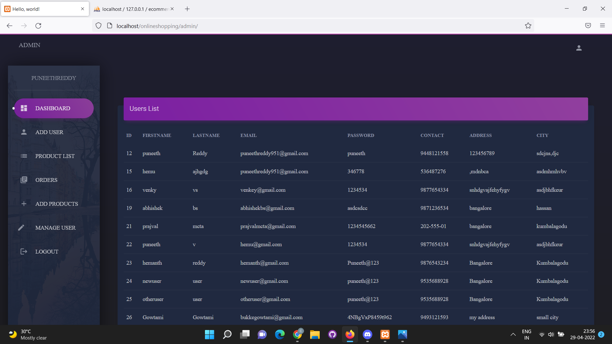
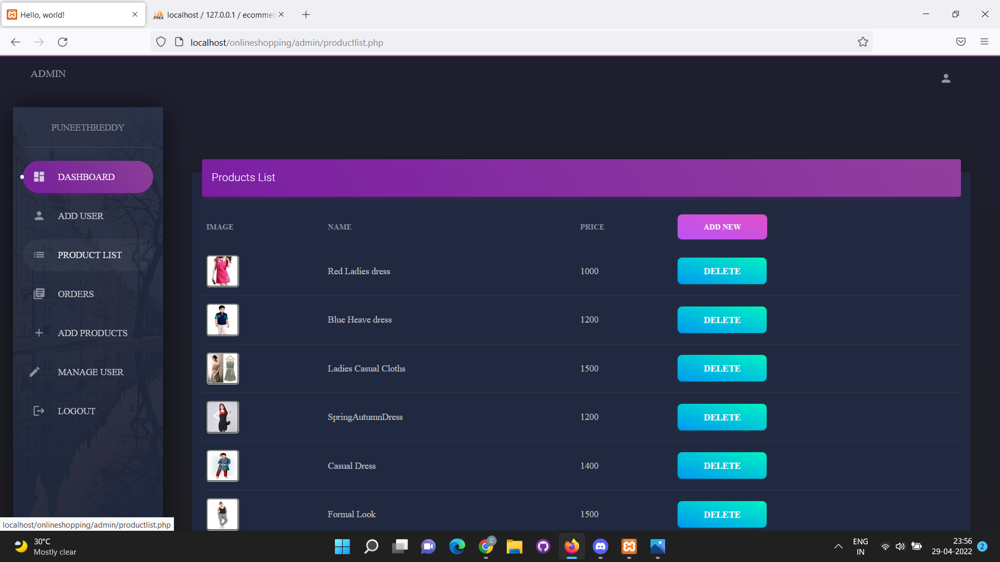
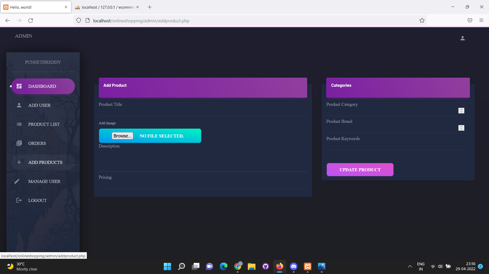

# OnlineShopping

System Features
⭐️ Dashboard Transaction in the Admin Panel
⭐️ Product Management
⭐️ Cart adding and quantity adjustment
⭐️ Can shop even without logging into the site but cant checkout
⭐️ Product Search
⭐️ Magnify product image
⭐️ Virtual Credit Card checkout
⭐️ User CRUD
⭐️ Product CRUD

How To Run?
To run this project you must have installed a virtual server i.e XAMPP on your PC. After Starting Apache and MySQL in XAMPP, follow the following steps

1st Step: Extract file
2nd Step: Copy the main project folder
3rd Step: Paste in xampp/htdocs/

Now Connecting Database
4th Step: Download Xampp in your pc then start the Apache and MySQL in it.
5th Step: Click on Start and Admin buttons in the xampp .
6th Step  By doing this it will direct to two webpages one with URL "http://localhost/phpmyadmin/" and other with URL "http://localhost/dashboard/"
7th Step: Open the browser and go to 1st URL “http://localhost/phpmyadmin/”
8th Step: Then, click on the databases tab
9th Step: Create a database naming “ecommerce” and then click on the import tab
10th Step: Click on browse file and select “onlineshopping.sql” file which is inside the “sql” folder of our main project which we have extracted in xampp/htdocs
11th Step: Click on go.
12th Step: This will generate all necessary tables required for our project.

After Creating Database,

13th Step: Open the other browser which we have opened in the step 6 and change it to "http://localhost/onlineshopping/" , this is user portal.
14th Step: Here user can sign up , login , enter his details, add items to cart, view his cart items, buy the items in cart , By providing card credentials he can pay for the product and can track the product.
15th Step: User to login as admin can navigate to browser URL "http://localhost/onlineshopping/admin/"
16th Step: Admin can see and edit the user details , he can add new users , view the product list, add new product, orders page (details of orders of users), logout etc.
17th Step: Dont close the webpage of URL "http://localhost/phpmyadmin/" during execution process.

SCREENSHOTS:

